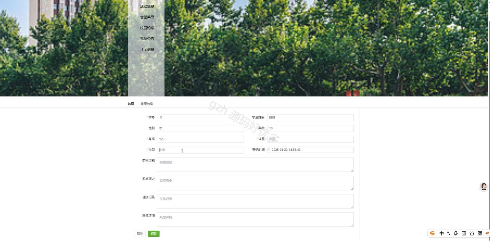

# springbootA397D
springbootA397D大学生校园生活智慧服务系统
## 查看主页获取源码

### 一、关键词

健康档案、校园活动、校园社团

 

### 二、作品包含

源码+数据库+全套环境和工具资源+部署教程

 

### 三、项目技术

前端技术：Html、Css、Js、Vue3.0、Element-plus
后端技术：Java、SpringBoot3.0、MyBatis

  

 

### 四、运行环境（以下版本亲测，其他版本未知，请自测）

开发工具：IDEA/eclipse  + VSCODE

数据库：MySQL5.7（最低要5.7版本）

数据库管理工具：Navicat10以上版本

环境配置软件： jdk17 + Maven3.6.3

前端Nodejs：20

浏览器：谷歌浏览器

 

### 五、项目介绍

项目编号：springbootA397D

大学生校园生活智慧服务系统整合校园各类生活服务资源，通过数字化平台，为大学生提供便捷、高效、一站式的校园生活服务，助力优化校园生活体验。

角色：管理员、用户

管理员：首页、菜单、健康档案、社团信息、操作日志、活动报名、预订信息、管理员、运动记录、社团报名、轮播图、学生、活动信息、食堂菜品、校园论坛、系统公告。

用户：首页、活动信息、食堂菜品、校园论坛、系统公告、社团信息、个人中心、修改密码、运动记录、社团报名、活动报名、健康档案、预订信息、我的发布。

 

### 六、运行截图

